# Global Airport Reccomendation System.

Want to build your own airport? Out of 19,000 airports listed in the U.S, 14,000 are privately owned. Building an airport isn't very complex and expensive compared to what people normally think. Building an airport can also bring positive impacts to the local community by supplying quite a various number of jobs. This is because builders, plumbers, and electricians will be needed for the building of the airport. In building airports there are several factors that matter. Altitude is one of the most important factors to think carefully about when building an airport. Operating at a high-altitude airport does require an additional amount of care. In this project, I will be creating a model that can help my clients what type of airport they should build based on the given features.

# 1. Data Source
Datahub is a center of data exchange that is supported by data science. It's an open platform that people can freely enter and numerous data sheets are provided for free. A lot of Data Scientists and Data engineers utilize this space to create ideas and make projects. 

• https://datahub.io/core/airport-codes

• https://datahubproject.io/

# 2. Method
Utilizing this datasheet, it was possible to make a decision of choosing the key feature which is altitude(elevation(ft)•). The column 'altitude_ft' was very important and helpful for me to understand the relationship between flights and density altitude. Due to the abundant external resources, it was possible for me to easily understand how to handle this dataset. 

# 3. Data Wrangling
• NaNs & Duplicated Rows - I plotted the MSNO matrix to see if the values are missing completely at random or not missing at random or just missing at random. The columns that contained null values were elevation_ft, continent, municipality, gps_code, local_code, and the missing values were definitely not missing with certain patterns. There were no Duplicated Rows. 

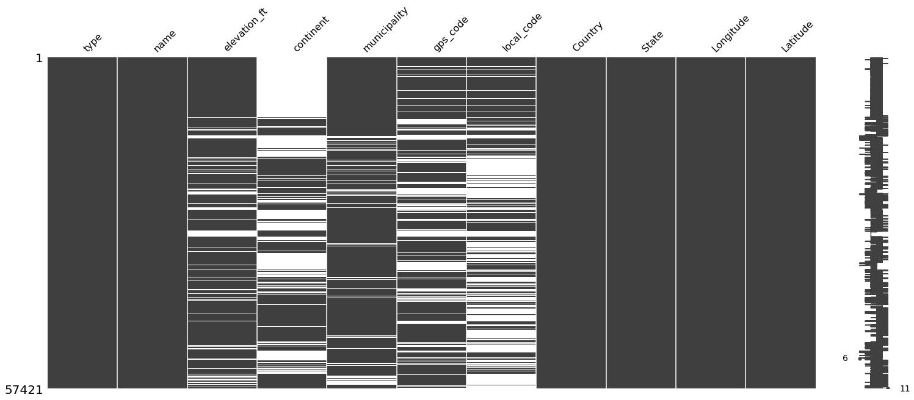

• Dropping Columns(Curse of Dimensionality) - The following 6 columns that were contained as primary key values. 
1. Name
2. Municipality
3. Gps_code
4. Iata_code
5. Local_code
It is reasonable to drop these columns because it wouldn't help the training for the model since every single value is unique.

• Outliers - There were too many outliers but most of them are within the 95% confidence interval. The ones which are outside of the interval are 2 data points. One in medium_airport and one in heliport. I took a look at them using external resources and those two values are facts so I kept them.

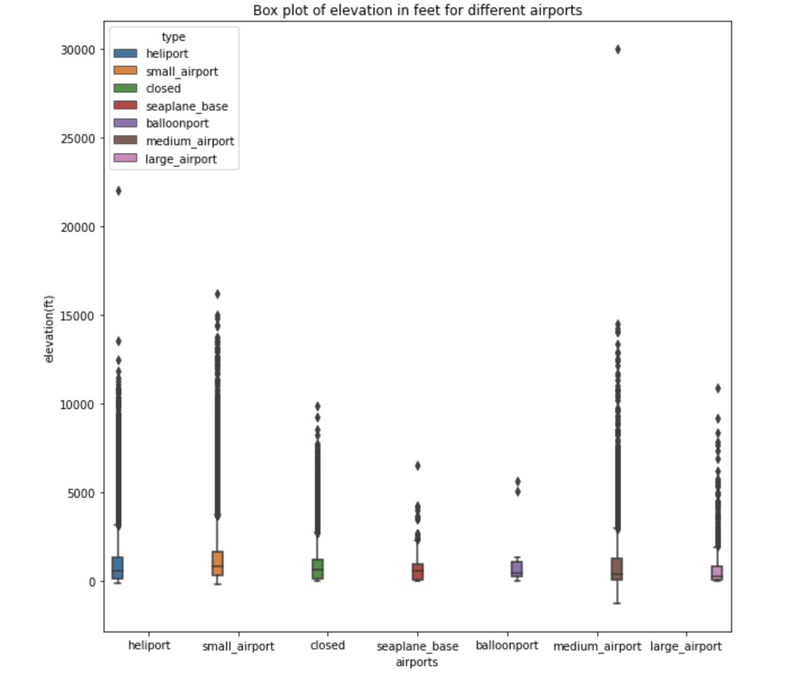

• Column merging - The counts for each airports have big gaps. The quantity of small airports has at least 3 times more than heliport, medim_airport, seaplane_base, large_airport, balloonport. I decided to group them up based on their mean elevation_ft. Therefore, I came up with the group seaplane_base as large_airport + seaplane_base and medium_airport as balloonport + medium_airport.

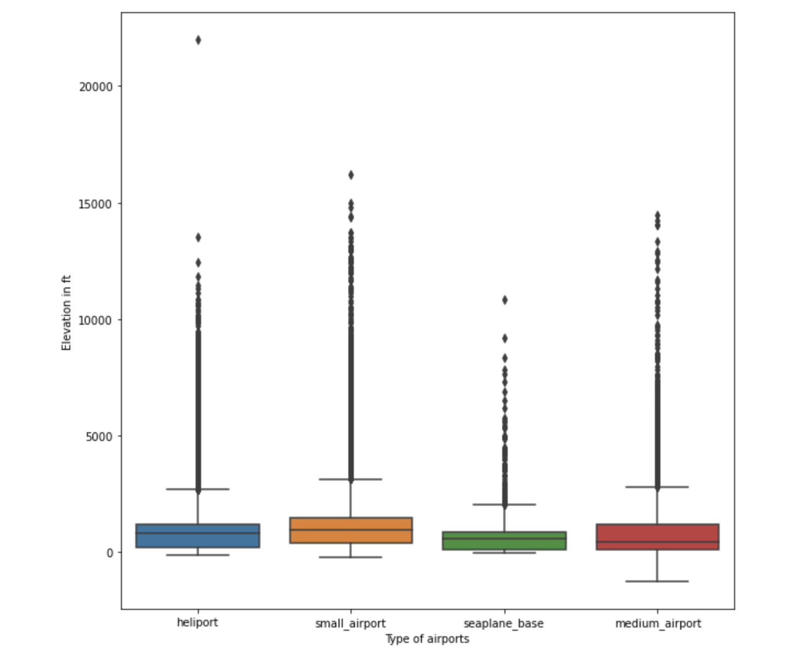

• False Information - I identified that a lot of values in the columns of the state weren't states. Some were actually continents and some were country names. Time is gold and I don't want to get stuck here too much so I dropped some values that weren't adequate.

# 4. EDA
• ECDF plot - Can visually see overall quantitative percentage respect to their corresponding range of elevation_ft.
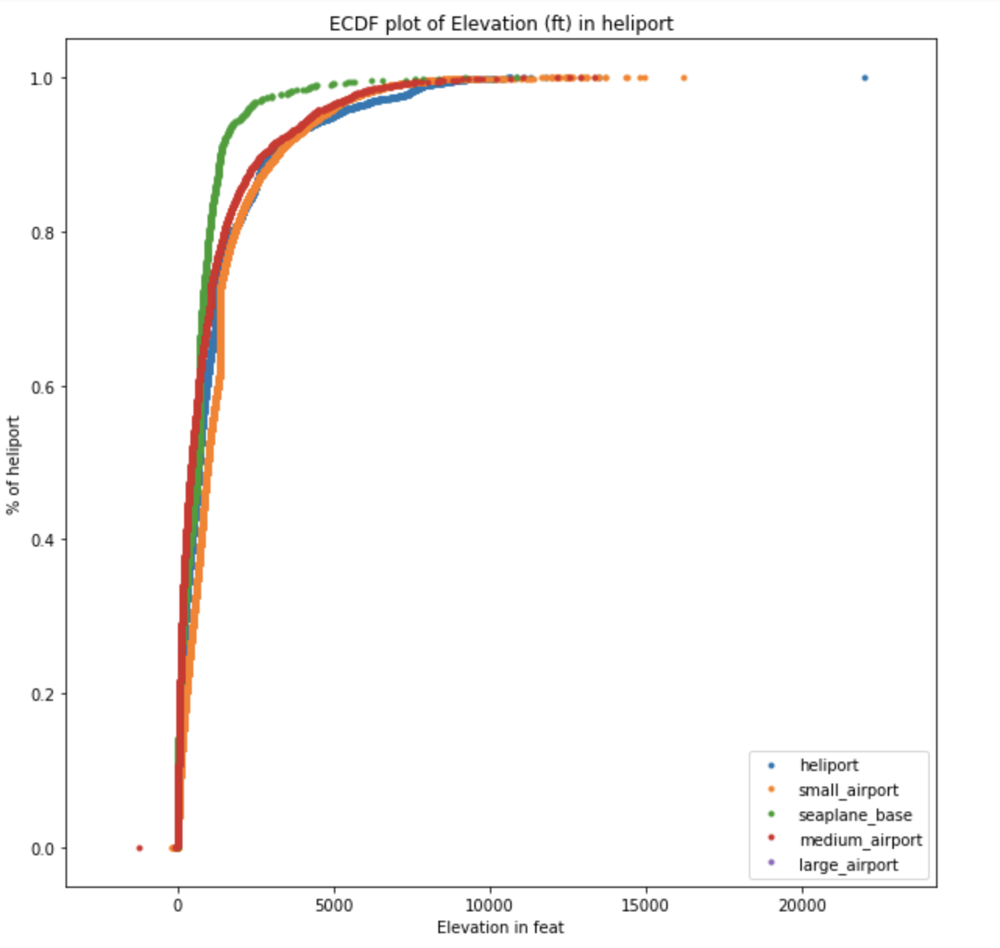

• One-way Anova - Used this test to find out if there is a difference in mean between the groups of airports. I was thinking to use two independent values which would lead me to test using two-way ANOVA but it wouldn't be necessary because for now, the key feature would be elevation_ft.

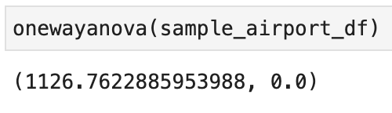

• Tukeyhsd - Tukey's HSD is a test I used to make sure how the mean for each group are statistically different from each other.
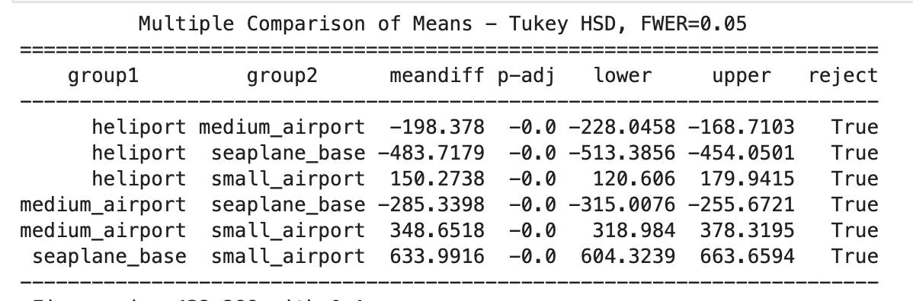

• Correlation - Yes, correlation. So drop Longitude or Latitude!

# 5. Preprocessing
• Train_test_val/Scaling/Encoding/Resampling/Weighting Techniques Used
• Split data -> dependent & independent values.
• Train(0.8), test(0.1), validation split data (0.1)
• Encode categorical features - binary encoder
  1. Why binary encoder? 
    Converts these categorical features to ordinal numbers and then changes these to binary and then different columns which are really advantageous when there are a lot of features.
  2. Binary encoder is a memory-efficient encoding scheme as it uses fewer features than one-hot encoding. It's really good when there are a lot of features because it reduces the curse of dimensionality for data with high cardinality. 

    
• Scaling - Standard Scaler
  - Makes it normally distributed
  - Mean = 0
  - Stdev = 1

# 6. Algorithms & Machine Learning
• I chose to boost classifiers because my dataset has not have many features and its robustness. Boosting models have the tendency to overfit meaning a high score on the training set but a very low score when we are generalizing the new data set. 

• Models used
  1. Light BGM Classifier
  2. Ada Boost Classifier
  3. Cat Boost Classifier

Note: Log loss increases as the predicted probability diverges from the actual label. The goal of our machine learning models is to minimize Log loss value. A perfect model would have a log loss of 0 which means if the log loss is lower, the better. 

• Log loss Equation for binary classification & multiclass
  - https://www.analyticsvidhya.com/blog/2021/03/binary-cross-entropy-log-loss-for-binary-classification/

# 7. Winner & Evaluation
• Hypothesis: Cat boost is going to have the best log loss score with the fastest training time. 

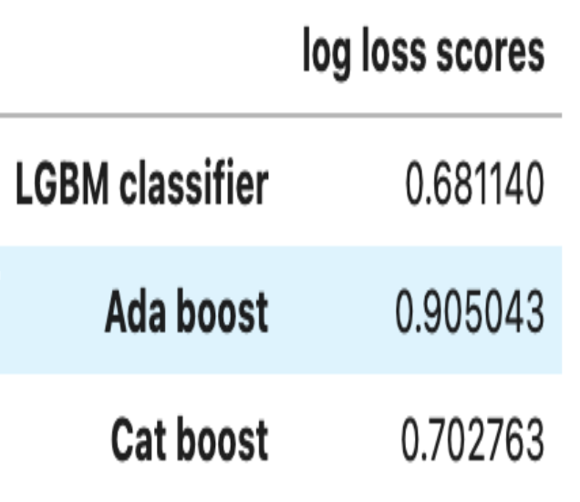

•  Overview: The light BGM was the fastest and most accurate model with a log loss score of 0.681140.

• I determined both the training and test scores for the models.

• Hypertuning Parameters: Found the optimal reg_alpha, reg_lambda, max_depth, num_leaves, colsample_bytree, maxbin, etc to account for overfitting.

• Classification Report

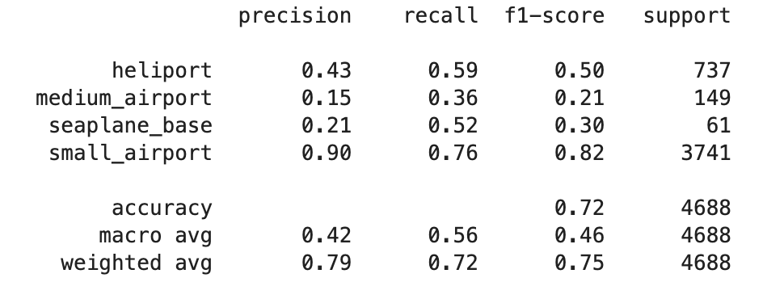

• Training_score, Accuracy, Precision, Recall, F1_score, logloss

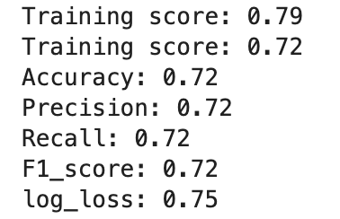

• ROC_AUC_Curve - The mBest ROC score is small_airport which makes sense because it had the most samples.

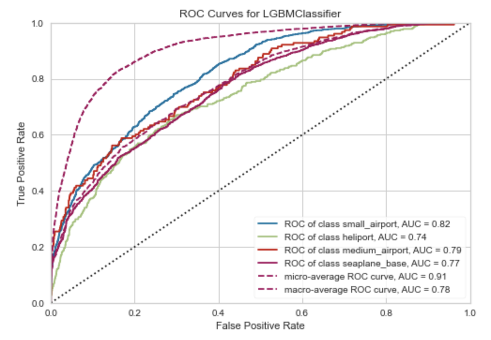

• ROC_AUC score for micro and macro. 

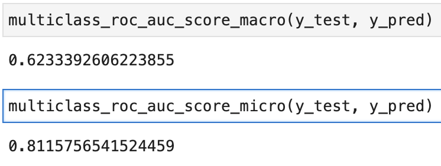

   - Why do micro and macro have different results?
    	- First of all, the macro-average will compute the metric independently for each class and then take the average (hence treating all classes equally). 
           
    	- Second, the micro-average will aggregate the contributions of all classes to compute the average metric. 
           
   	 - Therefore, in a multi-class classification setup, micro-average is preferable if you suspect there might be a class imbalance.

# 8. Future Improvements  
• Try to use more simple models and compare the results with the complex models.

• Out of 3 supervised classification models, LGBM provided the best results but had the most options for hyperparameter tuning so it might have been a biased result. So next time, it would be better to choose only several parameters and decide which one to use.

• Out of 12 features, we used only 4 features so let's try to add some more features.

• Add more parameters and try out more varieties such as the area, width, and height of each type of plane. 

